# BATTLESHIP

  

### INDICE

  
  

1.) [Introduzione](#1-introduzione)

2.) [Modello di dominio](#2-modello-di-dominio)

3.) [Requisiti specifici](#3-requisiti-specifici)

3.1 [Requisiti funzionali](#31-requisiti-funzionali)

3.2 [Requisiti non funzionali](#32-requisiti-non-funzionali)

4.) [System Design](#4-system-design)

4.1 [Stile architetturale adottato](#41-stile-architetturale-adottato)

4.2 [Diagramma dei package](#42-diagramma-dei-package)

4.3 [Decisioni prese riguardo ai requisiti non funzionali](#43-decisioni-prese-riguardo-ai-requisiti-non-funzionali)

5.) [OO Design](#5-oo-design)

5.1 [Diagramma delle classi](#51-diagramma-delle-classi)

5.2 [Diagramma di sequenza](#52-diagramma-di-sequenza)

5.3 [Principi di OO](#53-principi-di-oo)

5.4 [Design pattern](#54-design-pattern)

6 ) [Riepilogo dei test](#6-riepilogo-dei-test)

7.) [Manuale utente](#7-manuale-utente)

8.) [Processo di sviluppo e organizzazione del lavoro](#8-processo-di-sviluppo--organizzazione-del-lavoro)

9.) [Analisi retrospettiva](#9-analisi-retrospettiva)

9.1 [Analisi retrospettiva Sprint 0](#91-analisi-retrospettiva-sprint-0)

9.2 [Analisi retrospettiva Sprint 1](#92-analisi-retrospettiva-sprint-1)

  
  

### 1. INTRODUZIONE

Questo documento ha lo scopo di illustrare la prima versione dell'applicazione **BATTLESHIP**.

  

Il programma attraverso un interfaccia a linea di comando (*CLI*), permette all'utente di giocare contro il computer al famoso gioco della ***battaglia navale***. Il software si occupa di posizionare in maniera randomica le navi sulla mappa e l'utente dovrà affondare più navi nemiche possibili con il numero di mosse a disposizione (*determinate dalla difficoltà selezionata* ).

  

 

  
  

## 2. MODELLO DI DOMINIO

  

 

  
  
  

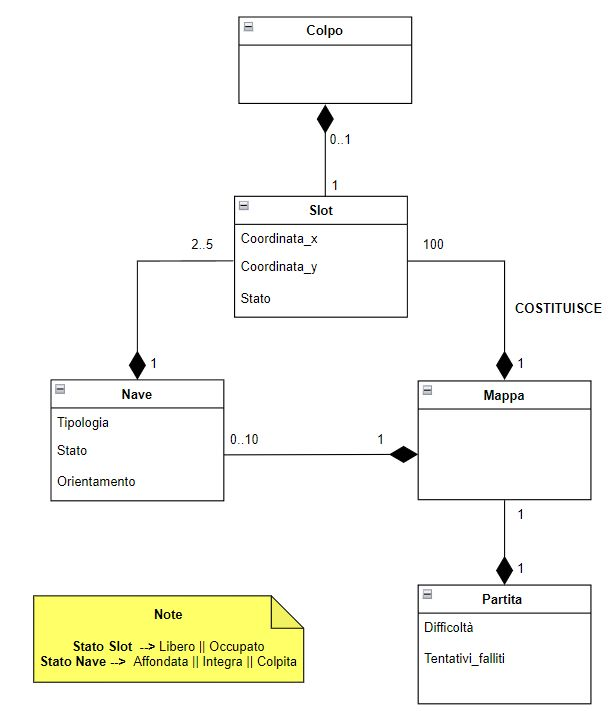

  
  
  

## 3. REQUISITI SPECIFICI

  
  
  

### 3.1 REQUISITI FUNZIONALI

Il software consente di :

  

-  ***#US1*** mostrare l'help con elenco comandi e regole del gioco  

-***Criteri di accettazione:*** 
Al comando ***/help*** o invocando l'app con flag --help o -h

il risultato è una descrizione concisa, che normalmente appare all'avvio del programma, seguita dalla lista di comandi disponibili, uno per riga.
 

  

-  ***#US2*** chiudere il gioco  

-***Criteri di accettazione:*** 
Al comando ***/esci***: l'applicazione chiede conferma  
• se la conferma è positiva, l'applicazione si chiude restituendo il controllo al sistema operativo. 
• se la conferma è negativa, l'applicazione si predispone a ricevere nuovi tentativi o comandi.
 

-  ***#US3*** impostare il livello di gioco per variare il numero massimo di tentativi falliti  

-***Criteri di accettazione:*** 
Al comando ***/facile***: l’applicazione risponde con OK e imposta a *50* il numero massimo di tentativi falliti.
Al comando ***/medio***: l’applicazione risponde con OK e imposta a *30* il numero massimo di tentativi falliti.
Al comando ***/difficile***: l’applicazione risponde con OK e imposta a *10* il numero massimo di tentativi falliti.
 
  

-  ***#US4*** mostrare il livello di gioco e il numero di massimo di tentativi falliti  

-***Criteri di accettazione:*** 
Al comando ***/mostralivello***: l’applicazione risponde visualizzando il livello di gioco e il numero di massimo di tentativi falliti.
 

 
-  ***#US5*** mostrare i tipi di nave e il numero 

-***Criteri di accettazione:*** 
Al comando ***/mostranavi***: l’applicazione risponde visualizzando, per ogni tipo di nave, la dimensione in quadrati e il numero di esemplari da affondare.

*Esempio di output*:

| Tipo di nave | Dimensione | Esemplari |

| --- | ----------- | --- |

| Cacciatorpediniere | ⊠⊠ | 4 |

| Incrociatore | ⊠⊠⊠ | 3 |

| Corazzata | ⊠⊠⊠⊠ | 2 |

| Portaerei | ⊠⊠⊠⊠⊠ | 1 |
 
  
  

-  ***#US6*** iniziare una nuova partita

-***Criteri di accettazione:*** 
Al comando ***/gioca***: se nessuna partita è in corso l'applicazione imposta causalmente le navi, in orizzontale o in verticale, mostra la griglia vuota e si predispone a ricevere il primo tentativo o altri comandi.
 
  

-  ***#US7*** svelare la griglia con le navi posizionate  

-***Criteri di accettazione:*** 
Al comando ***/svelagriglia***: l’applicazione risponde visualizzando, una griglia 10x10, con le righe numerate da 1 a 10 e le colonne numerate da A a J, e tutte le navi posizionate.
 

-   ***#US8*** impostare il numero massimo di tentativi falliti per il livello di gioco

-***Criteri di accettazione:*** 
Al comando ***/facile numero*** : l’applicazione risponde con OK e imposta a numero il numero massimo di tentativi falliti.
Al comando ***/medio numero***: l’applicazione risponde con OK e imposta a numero il numero massimo di tentativi falliti.
Al comando ***/difficile numero***: l’applicazione risponde con OK e imposta a numero il numero massimo di tentativi falliti.
 

-   ***#US9*** impostare direttamente il numero massimo di tentativi che si possono fallire

-***Criteri di accettazione***
Al comando ***/tentativi numero***: l’applicazione risponde con OK e imposta a numero il numero massimo di tentativi falliti.
 

-   ***#US10*** impostare la taglia della griglia

-***Criteri di accettazione***
Al comando ***/standard***: l’applicazione risponde con OK e imposta a 10x10 la dimensione della griglia (è il default). 
Al comando ***/large***: l’applicazione risponde con OK e imposta a 18x18 la dimensione della griglia.
Al comando ***/extralarge***: l’applicazione risponde con OK e imposta a 26x26 la dimensione della griglia.
 

-   ***#US11*** impostare il tempo di gioco

-***Criteri di accettazione***
Al comando ***/tempo numero***: l’applicazione risponde con OK e imposta a numero il numero minuti a disposizione per giocare.
 

-   ***#US12*** mostrare il tempo di gioco

-***Criteri di accettazione***
Al comando ***/mostratempo***: l’applicazione risponde visualizzando il numero di minuti trascorsi nel gioco e il numero di minuti ancora disponibili
 

- ***#US13*** effettuare un tentativo per colpire una nave

-***Criteri di accettazione***
Digitando una coppia di caratteri separati da un trattino, corrispondenti rispettivamente al numero di riga e alla lettera della colonna, (es. ***B-4***), l’applicazione risponde:
 • “acqua” se sulla cella non è posizionata nessuna nave; 
 • "colpito" se sulla cella è posizionata una nave; 
 • "colpito e affondato" se sulla cella è posizionata una nave ed è l’ultima cella non colpita della nave.
 Qualunque sia l’esito del tentativo, l’applicazione mostra la griglia con le navi colpite parzialmente o affondate, il numero di tentativi già effettuati, e il tempo trascorso. La partita termina con successo se il tentativo ha affondato l’ultima nave. La partita termina con insuccesso se è stato raggiunto il numero massimo di tentativi falliti o se è scaduto il tempo di gioco.
  
 
-   ***#US14*** mostrare la griglia con le navi colpite e affondate

-***Criteri di accettazione***
Al comando ***/mostragriglia***: l’applicazione risponde visualizzando, una griglia con le righe numerate a partire da 1 e le colonne numerate a partire da A, con le navi affondate e le sole parti già colpite delle navi non affondate.
 

-   ***#US15*** mostrare il numero di tentativi già effettuati e il numero di tentativi falliti

-***Criteri di accettazione***
Al comando ***/mostratentativi***: l’applicazione risponde visualizzando il numero di tentativi già effettuati, il numero di tentativi falliti e il numero massimo di tentativi falliti.
 

-   ***#US16*** abbandonare una partita

-***Criteri di accettazione***
Al comando ***/abbandona***: l'applicazione chiede conferma 
• se la conferma è positiva, l’applicazione risponde visualizzando sulla griglia la posizione di tutte le navi e si predispone a ricevere nuovi comandi. 
• se la conferma è negativa, l'applicazione si predispone a ricevere nuovi tentativi o comandi.
 

  
  

  

### 3.2 REQUISITI NON FUNZIONALI

  

  

Per eseguire correttamente il programma è necessario utilizzare un container **Docker** basato su Alpine Linux. Le **shell** compatibili sono:

  

  

- su **Windows**: Windows PowerShell, Git Bash;

  

  

- su **MacOS** e **Linux**: qualunque terminale con supporto a UTF-8 o UTF-16

  

  

>***Comando per l’esecuzione del container***

  

>Dopo aver eseguito il comando docker pull copiandolo da GitHub Packages, Il comando Docker da usare per eseguire il container contenente l’applicazione è:

  

  

>|>docker run --rm -it ghcr.io/softeng2223-inf-uniba/battleship-bernerslee:latest

 

## 4. SYSTEM DESIGN

### 4.1 STILE ARCHITETTURALE ADOTTATO
Il programma è stato sviluppato in **Java**, un linguaggio di programmazione multipiattaforma e orientato agli oggetti, che permette di eseguire programmi in maniera indipendente dal Sistema Operativo e dell'hardware sottostante.

Per il controllo di versione è stato utilizzato un repository privato su **GitHub**; per la compilazione è stato utilizzato **Gradle**, un sistema per l'automazione dello sviluppo.

Oltre al compilatore, la **toolchain** comprende: 

- **CheckStyle**, per il controllo dello stile di programmazione del codice;
- **SpotBugs**, per l'analisi statica e l'individuazione di pattern di errori ricorrenti;
- **Pmd**, per l'analisi statica e l'individuazione di pattern errati esclusivamente nelle test suite JUnit;
- **JUnit**, per il test di unità automatizzato tramite asserzioni;

In più, per l'integrazione continua, tramite **GitHub Actions** vengono costruite e pubblicate automaticamente, in corrispondenza di ogni pull request, le immagini **Docker** dell'applicazione sul repository **GitHub Packages**. 

Lo stile architetturale scelto nello specifico per il progetto è il modello ***Entity - Controll - Boundary***.

Essa è composta da tre componenti principali:
- ***Le entità (Entity)*** ovvero le classi responsabili delle persistenza dei dati incapsulati dall'astrazione, che prevalentemente effettuano operazioni di tipo get e set sugli attributi. 
- ***I controllori (Control)*** ovvero le classi responsabili del flusso di controllo delle user story contenenti la logica dell'applicazione
- ***Le Boundary*** ovvero le classi che rappresentano un interfaccia con il mondo esterno e responsabili della comunicazione con un attore.    

Ognuno di questi componenti ha un ruolo ben definito nel sistema, in modo tale da fornire una struttura organizzativa chiara e una separazione delle responsabilità all'interno del sistema. Questo stile architetturale favorisce una gestione efficiente dei dati e una chiara interazione con il mondo esterno.

 

### 4.2 DIAGRAMMA DEI PACKAGE

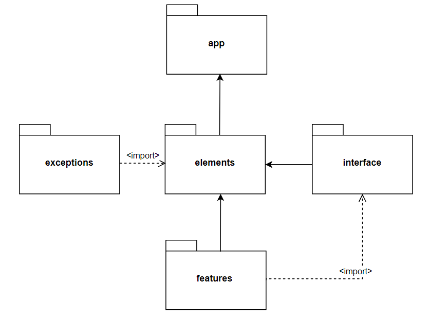

Il diagramma dei package mostrato nella figura qui sopra raffigura le relazioni tra i package della directory specifica`src.main.java.it.uniba`

 

### 4.3 DECISIONI PRESE RIGUARDO AI REQUISITI NON FUNZIONALI

Oltre a #RNF1, si è presa la decisione di settare la codifica in input dei caratteri a UTF-8 direttamente da java, così che possano essere supportati tutti i caratteri inseriti nel gioco.
 
Per quanto riguarda l'output, poichè l'immagine docker del programma viene eseguita da una kernel linux il set di caratteri di default è settato già per utf-8.

Inoltre sono stati utilizzati all'interno del software dei caratteri che appartengono a quella codifica. 

Per quanto riguarda la leggibilità del software, sono stati rispettati tutti i criteri CheckStyle, così da garantire uno stile di programmazione uniforme.

L'affidabilità del software è garantita dalla risoluzione di ogni Spotbugs riscontrato nelle fasi di sviluppo del programma.

 

## 5. OO DESIGN  

### 5.1 DIAGRAMMA DELLE CLASSI

Diagramma delle classi user story **#US3**:

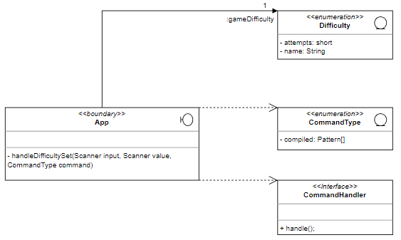

Diagramma delle classi user story **#US7**:

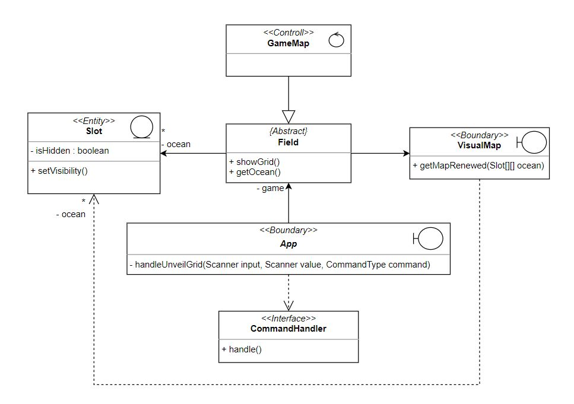

Diagramma delle classi user story **#US6**:

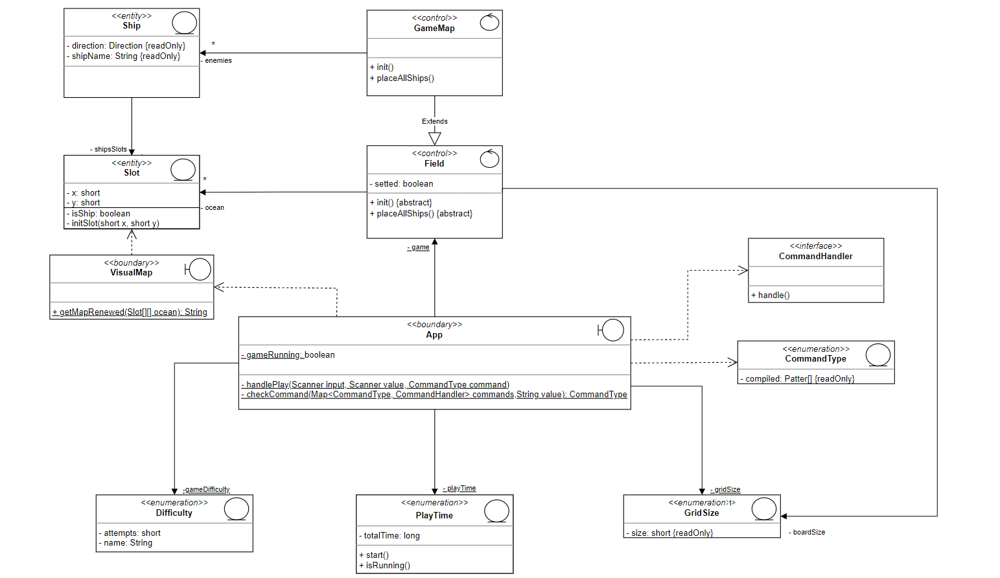

Diagramma delle classi user story **#US13**:

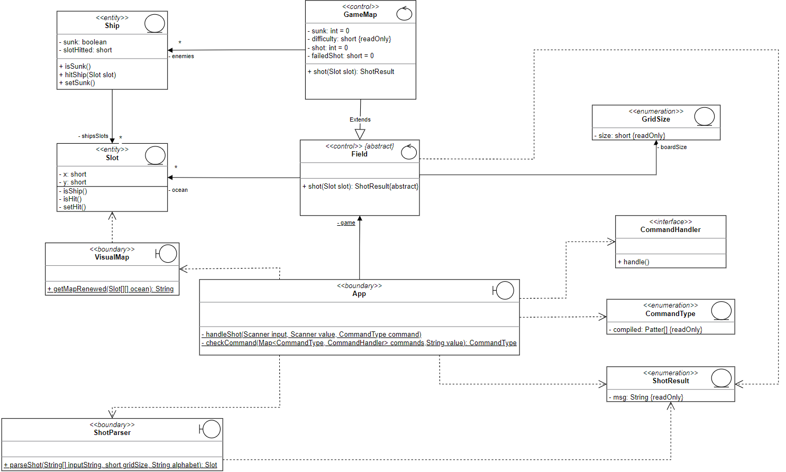

### 5.2 DIAGRAMMA DI SEQUENZA

Diagramna di sequenza per user story **#US3**:

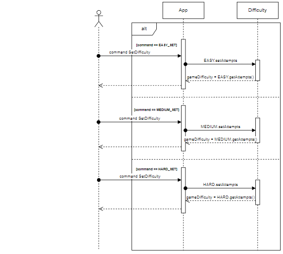

Diagramma di sequenza per classe user story **#US7**:

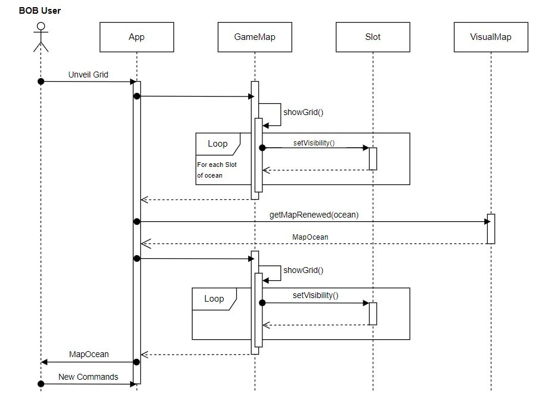

Diagramma di sequesnza user story **#US6**:

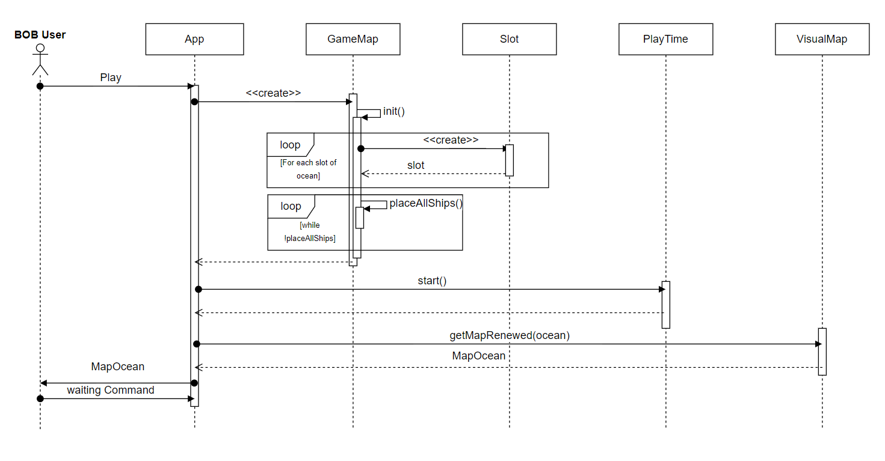

 

### 5.3 PRINCIPI DI OO

Per quanto riguarda le decisioni prese per  l'OO design, si è cercato di rispettare il principio di presentazione separata andando a creare una classe utilitaria (che implementa solo metodi statici) per la visualizzazione della mappa. (In una versione precedente di Field.java, c'erano due metodi che facevano la stessa cosa).

Si è cercato di rispettare il principio della ***Single Responsibility***, il quale afferma che ongni classe dovrebbe essere responsabile di un'unica responsabilità o compito. Per favorire un alta coesione e bassa dipendenza tra le classi.
*Field.java* e *GameMap.java* gestiscono la logica del gioco, mentre invece gli enumerativi definiscono gli elementi del gioco.

Si è cercato di rispettare anche il principio di ***Open/Closed***, per il quale le classi, moduli, funzioni, dovrebbero essere aperte all'estensione e non chiuse. Infatti non è stato modificato del codice esistente, ma è stato esteso il comportamente attraverso l'ereditarietà, l'implementazione di interfacce o la composizione.

Inoltre si è cercato di applicare anche un uso corretto delle *generalizzazione*, per il quale le sottoclassi devono poter essere utilizzate al posto delle loro classi padre, rispettando il principio ***Liskov Substitution***. Nel nostro caso la classe *GameMap.java* può essere utilizzato come un oggetto *Field*.

Sicuramente è stato applicato anche il principio dell'***Inforrmation Hiding*** in tutte le classi e anche il principio ***DRY (Do Not Repeat Yourself)*** (A parte per qualche costrutto switch-case). Per evitare il DRY è stata ridefinito il parser/handler dei comandi, utilizzando una mappa che punta a funzioni statiche che implementano l'interfaccia funzionale *CommandHandler.java*.
 

## 5.4 DESIGN PATTERN

Nel codice, la classe `PlayTime` è implementata come un'enumerazione, ma utilizza un approccio particolare per creare un Singleton attraverso la dichiarazione di un'istanza di enumerazione denominata "INSTANCE". Il motivo per cui `PlayTime` è implementato come enumerazione anziché una classe con pattern Signleton, è per garantire una maggiore sicurezza (perchè gli oggeti enumerativi vengono inizializzati in modo sicuro e thread-safe dal caricatore di classi) e  facilità da testare (perché l'oggetto PlayTime può essere "mocked or stubbed" nei test unitari). Garantisce anche di evitare i problemi di Spotbugs come `"Public static it.uniba.features.PlayTime.getInstance() may expose internal representation by returning PlayTime.instance  At SpotBugs ended with exit code 1"` (perchè enumerativi sono progettati per rappresentare un insieme limitato di istanze uniche e immutabili), che può portare a problemi di manutenibilità e comportamento imprevisto nel codice. Quindi, l'utilizzo del Singleton in questo caso specifico è finalizzato a garantire che ci sia una sola istanza di "PlayTime" all'interno dell'applicazione. I metodi all'interno della classe `PlayTime` che utilizzano l'instanza Singleton sono:

- L'instanza Singleton viene utilizzata da metodi come `getRemainingTime()`, `getRemainingTimeInMillis()`, `getTotalTime()`, `getElapsedTime()`, `start()` e `stop()`, per ottenere informazioni sul tempo rimanente, tempo trascorso, tempo totale e per controllare l'avvio o l'interruzione del timer.

- Il metodo `isRunning()` per verificare se il timer è in esecuzione o meno, basandosi sul tempo rimanente.

- La classe interna `TimerRunnable` viene utilizzata per implementare il timer stesso, controllando se il timer è in esecuzione o meno attraverso il metodo `isRunning()`.

 

## 6. RIEPILOGO DEI TEST

Sono stati sviluppati *42 casi di test* che coinvolgono le classi:
- AppTest.java
- TestGameMap.java
- TestShip.java
- TestVisualMap.java
- TestDifficulty
- TestPlayTime. 

Per classi sopraelencate sono state individuate delle classi di equivalenza che testano **valori specifici** (identificando una classe valida per il valore specifico, una non valida per tutti i valori inferiori e una non valida per tutti i valori al di sopra), come ad esempio il test *testShipInitializationSmaller()* in testShip che verifica che la nave  inizializzata non sia più piccola di quella istanziata. Classi di equivalenza che verificano che una determinata **eccezione** venga lanciata (come ad esempio il caso di test *testCannotPlaceAShipBeacuaseItsAlreadyAShip()* in testGameMap.java).

Inoltre i casi di test sono stati posizionati nel package  `src.test.java.it.uniba` in modo tale da rispettare la stessa gerarchia delle classi nel package `src.main.java.it.uniba`

 

## 7. MANUALE UTENTE

  
L'applicazione '*Battleship*' mira a ricreare l'esperienza dell'omonimo gioco da tavolo, caratterizzata dalla simulazione su terminale della mappa e di tutte le sue caratteristiche.

Per utilizzare l'applicazione è necessario eseguire i seguenti passaggi:

- scaricare e installare la distribuzione di **Docker** per la propria piattaforma software;

- scaricare il progetto da **GitHub Packages** tramite il comando

`docker pull ghcr.io/softeng2223-inf-uniba/battleship-bernerslee:latest`

- eseguire il programma tramite **Docker** attraverso il comando

`docker run --rm -it ghcr.io/softeng2223-inf-uniba/battleship-bernerslee:latest`

Quando il programma sarà avviato verrà visualizzato il messaggio "*/help per avere un aiuto soldato! *".

Ora il programma è in attesa di input e viene visualizzato il simbolo "**|>**".

 

  

### *(/help)*

  

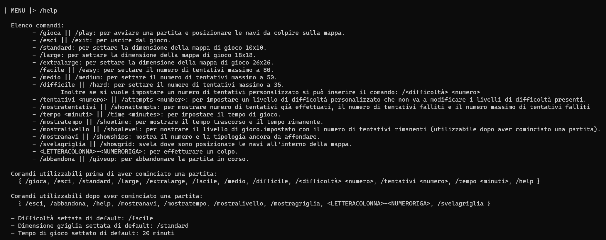

  

Digitando il comando ***/help*** verrà visualizzato la lista dei comandi:

  

- con il comando ***/gioca*** o ***/play*** si può avviare una partita e posizionare le navi da colpire sulla mappa.

- con il comando ***/esci*** o ***/exit*** si può uscire dal gioco.

- con il comando ***/standard*** si può settare la dimensione della mappa di gioco 10x10

- con il comando ***/large*** si può settare la dimensione della mappa di gioco 18x18

- con il comando ***/extralarge*** si può settare la dimensione della mappa di gioco 26x26

- con il comando ***/facile*** o ***/easy*** si può settare il numero di tentativi massimo a 50

- con il comando ***/medio*** o ***/medium*** si può settare il numero di tentativi massimo a 30

- con il comando ***/difficile*** o ***/hard*** si può settare il numero di tentativi massimo a 10

- con il comando ***/difficoltà numero*** si può settare il numero di tentativi personalizzato

- con il comando ***/tentativi numero*** o ***/attempts numero*** si può impostare un livello di difficoltà personalizzato che non va a modificare i livelli di difficoltà presenti

- con il comando ***/mostratentativi*** o ***/showattempts*** si può mostrare il numero di tentativi già effettuati, il numero di tentativi falliti e il numero massimo di tentativi falliti

- con il comando ***/tempo minuti*** o ***/time minuti*** si può impostare il tempo di gioco

- con il comando ***/mostratempo*** o ***/showtime*** si può mostrare il tempo trascorso e il tempo rimanente

- con il comando ***/mostralivello*** o ***/showlevel*** si può mostrare il livello di gioco impostato con il numero di tentativi rimanenti (utilizzabile dopo aver cominciato una partita).

- con il comando ***/mostranavi*** o ***/showships*** si può mostrare il numero e la tipologia ancora da affondare (utilizzabile dopo aver cominciato una partita).

- con il comando ***/svelagriglia*** o ***/showgrid*** si può svelare dove sono posizionate le navi all'interno della mappa(utilizzabile dopo aver cominciato una partita).

- con il comando ***LETTERA_COLONNA  - NUMERO_RIGA*** si può effettuare un colpo

- con il comando ***/abbandona*** o ***/giveup*** si può abbandonare una partita in corso 

-  Comandi ***utilizzabili prima di aver cominciato una partita:***
    { /gioca, /esci, /standard, /large, /extralarge, /facile, /medio, /difficile, /difficoltà numero, /tentativi numero, /tempo minuti, /help }

-  Comandi ***utilizzabili dopo aver cominciato una partita:***
    { /esci, /abbandona, /help, /mostranavi, /mostratempo, /mostratentativi, /mostralivello, /mostragriglia, LETTERACOLONNA - NUMERORIGA , /svelagriglia }
 

  

### *(/gioca)*

  

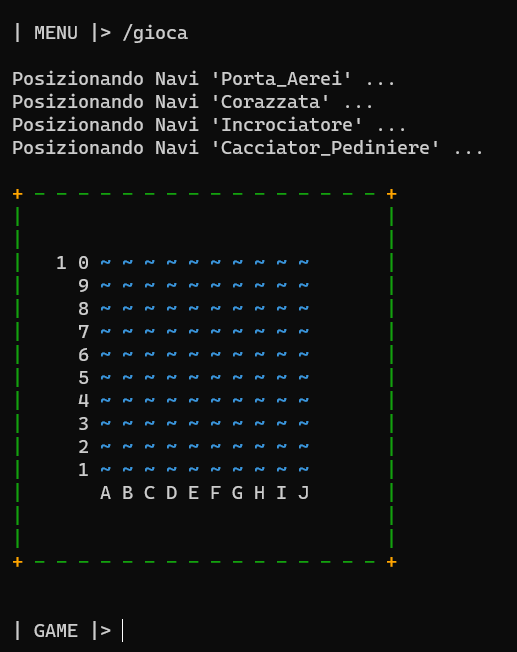

  

Digitando il comando ***/gioca*** o ***/play*** si può avviare una partita e posizionare le navi da colpire sulla mappa. Verrà visualizzata anche la mappa di gioco.

 

### *(/exit)*

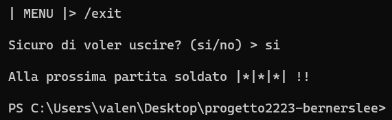

Digitando il comando ***/esci*** o ***/exit*** si può uscire dal gioco.

 

### *(/standard)*

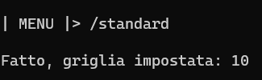

Digitando il comando ***/standard*** si può settare la dimensione della mappa di gioco 10x10

 

### *(/large)*

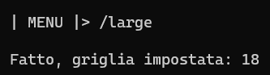

Digitando il comando ***/large*** si può settare la dimensione della mappa di gioco 18x18

 

### *(/extralarge)*

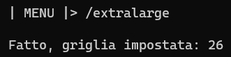

Digitando il comando ***/extralarge*** si può settare la dimensione della mappa di gioco 26x26

 

### *(/facile)*

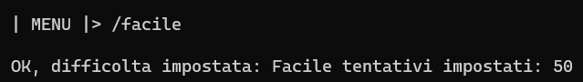

Digitando il comando ***/facile*** o ***/easy*** si può settare il numero di tentativi massimo a 50

 

### *(/medio)*

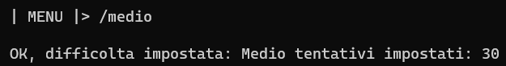

Digitando il comando ***/medio*** o ***/medium*** si può settare il numero di tentativi massimo a 30

 

### *(/difficile)*

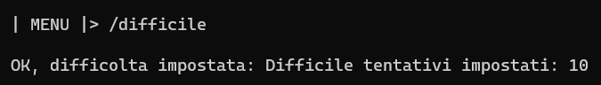

Digitando il comando ***/difficile*** o ***/hard*** si può settare il numero di tentativi massimo a 10

 

### *(/<difficoltà> numero)*

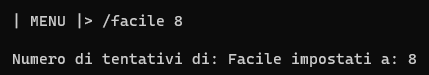

Digitando il comando ***/difficoltà numero*** si può settare il numero di tentativi personalizzato

 

### *(/tentativi numero)*

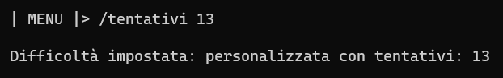

Digitando il comando ***/tentativi numero*** o ***/attempts numero*** si può impostare un livello di difficoltà personalizzato che non va a modificare i livelli di difficoltà presenti

 

### *(/mostratentativi)*

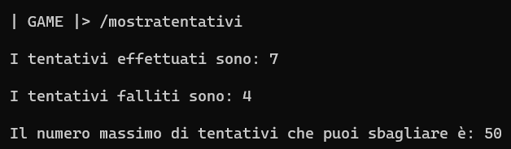

Digitando il comando ***/mostratentativi*** o ***/showattempts*** si può mostrare il numero di tentativi già effettuati, il numero di tentativi falliti e il numero massimo di tentativi falliti

 

### *(/tempo minuti)*

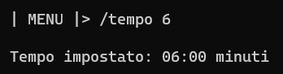

Digitando il comando ***/tempo minuti*** o ***/time minuti*** si può impostare il tempo di gioco

 

### *(/mostratempo)*

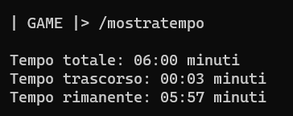

Digitando il comando ***/mostratempo*** o ***/showtime*** si può mostrare il tempo trascorso e il tempo rimanente

 

### *(/mostralivello)*

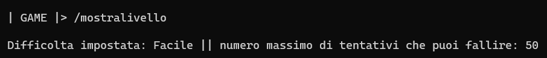

Digitando il comando ***/mostralivello*** o ***/showlevel*** si può mostrare il livello di gioco impostato con il numero di tentativi rimanenti (utilizzabile dopo aver cominciato una partita)

 

### *(/mostranavi)*

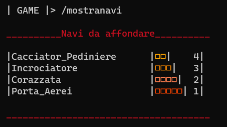

Digitando il comando ***/mostranavi*** o ***/showships*** si può mostrare il numero e la tipologia ancora da affondare (utilizzabile dopo aver cominciato una partita).

 

### *(/svelagriglia)*

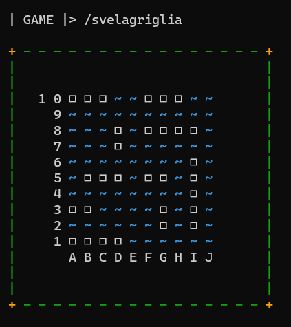

Digitando il comando ***/svelagriglia*** o ***/showgrid*** si può svelare dove sono posizionate le navi all'interno della mappa(utilizzabile dopo aver cominciato una partita).

 

### *(/LETTERA_COLONNA - NUMERO_RIGA)*

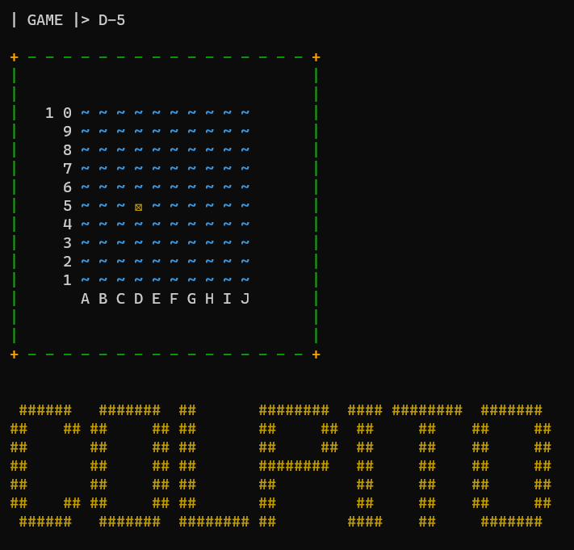

Digitando il comando ***LETTERA_COLONNA-NUMERO_RIGA*** si può effettuare un colpo

 

### *(/abbandona)*

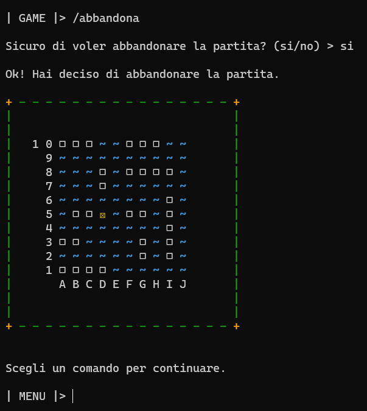

Digitando il comando ***/abbandona*** o ***/giveup*** si può abbandonare una partita in corso 

 

## 8. PROCESSO DI SVILUPPO & ORGANIZZAZIONE DEL LAVORO

Il progetto che abbiamo realizzato consiste nel creare il gioco della ***battaglia navale***, in solitario a riga di comando in **Java**. Il processo di sviluppo e organizzazione del lavoro è stato il seguente: abbiamo suddiviso il progetto in tre fasi principali, ovvero: analisi, progettazione e implementazione. (ripetuto per ogni sprint). Nella fase di analisi, abbiamo studiato le regole del gioco, i requisiti funzionali e non funzionali, e i casi d'uso. Abbiamo anche definito le classi principali e le loro relazioni. Nella fase di progettazione, abbiamo definito le classi e i metodi necessari per implementare la logica del gioco, l'interfaccia utente e la gestione degli elementi di gioco. Nella fase di implementazione, abbiamo scritto il codice java seguendo le convenzioni di stile e i principi di programmazione orientata agli oggetti. Abbiamo anche effettuato dei test per verificare il corretto funzionamento del programma. Tra le difficoltà incontrate, possiamo citare la gestione delle eccezioni e la generazione casuale della posizione delle navi. Nella fase di testing, abbiamo eseguito dei test unitari e di integrazione per verificare il corretto funzionamento del programma e la sua conformità alle specifiche. Abbiamo anche effettuato dei test di usabilità con degli utenti esterni per valutare l'esperienza d'uso del gioco.

Tutte le decisioni sono state prese di comune accordo; le problematiche sono state gestite tramite gli strumenti offerti da **GitHub** e discusse quando possibile su piattaforme online quali **WhatsApp** e **Telegram**.

All'inizio di ogni nuovo sprint, il team si è riunito in un meeting di pianificazione per organizzare il lavoro da svolgere (attraverso le **Project Board**) e suddividere i task tra i membri del team. In particolare è stato necessario individuare le dipendenze tra i singoli task e stabilire l'ordine in cui completarli. 

Lavorare in maniera agile ha favorito il rispetto dei tempi di consegna e ha contribuito a migliorare la collaborazione e l'affiatamento tra i membri del team.

All'inizio di ogni pomeriggio di sviluppo, ogni membro del team aggiornava gli altri sul lavoro svolto in precedenza ed informava il resto del team di eventuali problematiche riscontrate. Inoltre ci si confrontava sul lavoro ancora da svolgere, scambiando idee su come proseguire in maniera ottimale.

I task più complessi sono stati svolti in video call su **Meet**. Il lavoro svolto veniva poi approvato da chi non era presente, dopo essere stato adeguatamente revisionato.

Alla fine di ogni sprint, prima della consegna, il team si riuniva per controllare che il lavoro fosse stato svolto nel miglior modo possibile, così da evitare problemi con una ricaduta negli sprint successivi. Dopo la consegna, si discuteva di come poter migliorare l'interazione e il lavoro del team.

## 9. ANALISI RETROSPETTIVA

  
  

## 9.1 ANALISI RETROSPETTIVA SPRINT 0

  

La riunione è iniziata con la verifica degli obiettivi dello sprint precedente. Siamo riusciti a completare tutte le user story previste.

  
  

Siamo poi passati alla discussione dei punti di forza e delle criticità dell'ultimo sprint. Il team ha identificato come punto di forza l'efficace comunicazione tra i membri del team e la grande collaborazione che abbiamo avuto, sopratutto nel rispetto delle tempistiche di consegna e nella velocità di risposta ad eventuali problematiche. Tra le criticità, invece, abbiamo notato una certa superficialità nelle approvazioni delle pull request e nella non completa osservanza delle regole redette nel code of conduct.

  
  

Dopo aver discusso le criticità, il team ha proposto diverse soluzioni per migliorare il processo di sviluppo. Abbiamo deciso di evitare un controllo superficiale delle modifiche apportate alla repository nell'accettazione di una pull request di un altro membro del team, e di evitare di pushare sul branch main della repository remota dei file inutili.

  
  

Infine, abbiamo definito gli obiettivi per il prossimo sprint, che includono una maggiore attenzione e cooperazione durante le pull request da parte di tutti i componenti del team.

  
  

Conclusione:

  

La riunione si è conclusa con un feedback molto positivo da parte di tutto il team. Siamo tutti impegnati a lavorare insieme per migliorare costantemente il nostro processo di sviluppo e la qualità del nostro software.

  

 

  

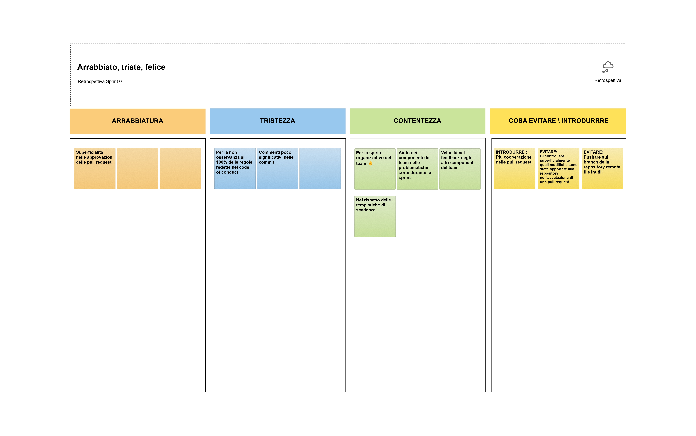

  
  
  

## 9.2 ANALISI RETROSPETTIVA SPRINT 1

  
  

La riunione è iniziata con la verifica degli obiettivi dello sprint precedente. Siamo riusciti a completare tutte le user story previste.

  

Inizialmente si è discusso sulla revisione superficiale delle commit inerenti a modifiche nelle Pull Request da parte dei componenti del team; inoltre è emerso che continuano ad esserci dei messaggi non molto esplicativi nelle commit. E'stato fatto anche un commento anche sulla qualità del codice, in quanto non risultava, in alcune classi, manutenibile a lungo termine.

  

Successivamente sono emerse le problematiche che hanno reso i componenti del team alquanto tristi, ad esempio si è riscontrata ambiguità nei criteri di accettazione di alcune user story e poca velocità nell'approvazione delle Pull Request.

  

Continuando sono emersi gli aspetti che hanno contribuito alla contentezza generale del team, come ad esempio un ottimo spirito collaborativo del team, la consegna del risultato dello Sprint 1 entro il termine di scadenza e l'efficace risoluzione di tutti i problemi emersi durante lo sviluppo.

  

Infine, abbiamo definito gli obiettivi per il prossimo sprint, che includono una maggiore collaborazione nello svuluppo del report finale, una maggiore attenzione riguardo i Definition of Done per lo Sprint 2 e di evitare di pushare del codice sorgente che presenta ancora errori CheckStyle e Spotbugs.

  

Conclusione:

  

Nel complesso, lo sprint è stato positivo, nonostante alcuni punti da migliorare e nonostante la perdita di due punti per errori relativamente stupidi. Il gruppo ha raggiunto gli obiettivi prefissati, ha lavorato bene insieme e ha creato codice di discreta qualità. Nelle prossime fasi dello sviluppo, ci aspettiamo un miglioramento continuo grazie alle azioni correttive identificate.

  

 

  

